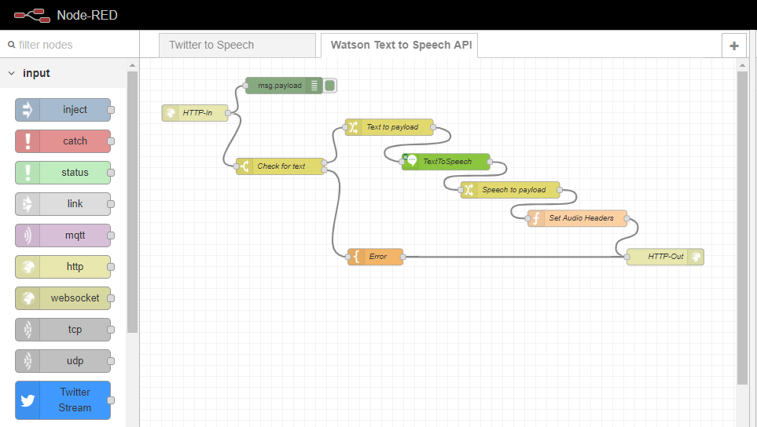
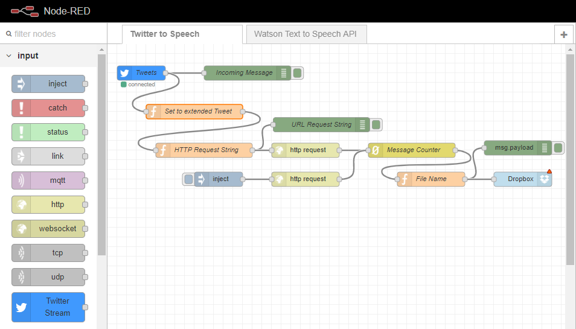

WatsonTextToSpeechAPI
=====================

### About

This project uses two Node-Red flows which work together to read Tweets from the Twitter API, use the [IBM Watson Text To Speech](https://www.ibm.com/watson/services/text-to-speech/) API to process that text, and then encode the output in files that are saved to a dropbox account. From there the files can be picked up by other applications for further processing.

### Watson Text To Speech API

The core of the project is a Node-Red flow which provides a RestAPI for interacting with the Watson Text To Speech service. The HTTP-In receives an HTTP request from another application. This request should contain a text string for processing, otherwise the application will output an return an error. The text payload is forwarded to the IBM Text to Speech service. 

Once processed the sound file can be returned in a number of formats that can be selected in the TextToSpeech node. These include `.wav`, `.flac`, `.ogg`, `.mpeg` and `.mp3`. Once the converted soun file is returned a function sets the correct audio media header before passing the file to the HTTP-Out.

**Note:** In order to use this flow the user will first need to set up an IBM Cloud account and an the IBM Watson Text to Speech instance. See IBM Cloud Docs guide [Text to Speech: Getting started tutorial](https://console.bluemix.net/docs/services/text-to-speech/getting-started.html#gettingStarted).

### Twitter To Speech

This flow provides an example of how to utilise the Watson Text To Speech API in the context of a wider project. 

The Twitter Stream node calls Twitter using a combination of usernames and/or hashtags to return tweets in real-time. A function then ensures that the extended tweet is used. The extended tweet text is then reformatted and an HTTP request is sent to the Watson Text To Speech API flow (described above).

The response to the HTTP request is output as a binary buffer. Every processed sound output is counted. That count is then used added to the name of the output file to provide uniqueness and avoid overwriting. That file is then posted to an app folder on dropbox. Be aware that if the Node-Red flow is stoped the count will return to zero and any existing files in dropbox may be overwritten. The flow may also output empty files if there are issues with the HTTP request or sound file processing.

**Note:** In order to use the Twitter Stream Node the user will need to sign up for a Twitter developer account and set up a Twitter app. See [Twitter developer apps: Overview](https://developer.twitter.com/en/docs/basics/apps/overview). To send files to Dropbox using the Dropbox node you will need a Dropbox account and you will need to set up an 'app folder' on your account. See [DBX Platform developer guide](https://www.dropbox.com/developers/reference/developer-guide). 
